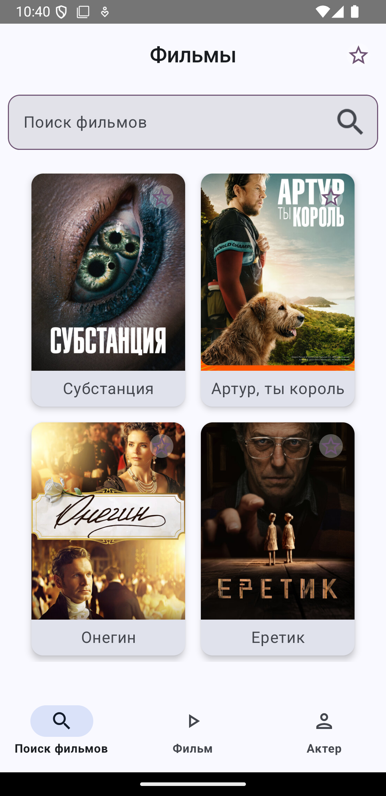

  

<h3>Kinopoisk Lite</h3>
<h5>Просмотр и поиск фильмов, просмотр актеров</h5>

# Видео
[KinopoiskLite_video.webm](https://github.com/user-attachments/assets/dcc32fc7-d5dc-41a2-aef3-5d52ef0d03b2)

# Скриншоты

  
  
  
  

# Возможности
- **Список фильмов текущего года с высоким рейтингом**.
- **Добавление фильма в избранные**.
- **Просмотр деталей фильма**.
- **Просмотр деталей актера**.

# Стек технологий

- **Kotlin**.
- **Compose**.
- **Многомодульность**.
- **Single Activity**.
- **MVVM (ViewModel + StateFlow)**.
- **Hilt (DI)**.
- **Retrofit**.
- **Room**.
- **JUnit и Mockito**.

# REST API
https://kinopoiskdev.readme.io/reference/moviecontroller_findonev1_4

# Связи между модулями

  

